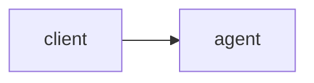

# 三、cookie与代理机制

## 1 cookie

### 概要

- cookie：
	- 是存储在客户端的一组键值对
	- Web中cookie的典型应用：
		- 免密登录
	- cookie与爬虫的关联：
		- 有时，不携带cookie对页面进行请求时无法请求到正确的页面数据
		- 因此，cookie是爬虫中一个经典的反爬机制
	
> - **需求1：爬取雪球网的资讯信息**
> 
> - url:<https://xueqiu.com/>

- 分析：
	- 1. 判定所要爬取的数据是否为动态加载
		- 相关的更多数据为动态加载，随着鼠标下拉页面，数据逐步加载
	- 2. 定位到Ajax请求到的数据包，提取请求的url，响应数据为json形式的资讯数据
	
- **问题1：**
	- 请求到的页面数据为错误代码
	
- 原因：
	- 没有按照严格意义上的浏览器行为模拟请求--未携带cookie
	
- 处理：
	- 完全复制浏览器的请求头Request Headers作用到requests的get操作中

- **cookie的处理方式：**
	- 方式1：手动处理
		- 将抓包工具中的cookie直接粘贴在header中
		- 弊端：cookie具有时效性，过了有效时长后会失效
	- 方式2：自动处理
		- 基于**Session对象**实现自动处理
			- 如何获取一个Session对象：requests.Session()返回一个Session对象
		- Session对象的作用：（首次请求捕获并存储cookie）
			- 该对象可以像requests一样调用get与post发起指定的请求
			- Session发起请求的过程中产生的cookie会被自动存储到对象
			- 即Session的再次请求便为携带cookie的请求
		- 关键：
			- cookie的捕获页面不确定， 需要多次尝试

```python
improt requests

def information_crawl():
    """
    爬取雪球网的资讯信息--'https://xueqiu.com/'

    破解cookie反爬：
        通过Session对象解决需要携带cookie的页面请求
    """

    headers = {
        'User-Agent': 'Mozilla/5.0 (Windows NT 10.0; Win64; x64) AppleWebKit/537.36 (KHTML, like Gecko) '
                      'Chrome/84.0.4147.89 Safari/537.36 FS '
    }

    session = requests.Session()  # 创建Session对象用以在首次请求中捕获并存储cookie
    main_url = 'https://xueqiu.com/'
    session.get(main_url, headers=headers)  # 捕获且存储cookie

    url = 'https://xueqiu.com/statuses/hot/listV2.json?since_id=-1&max_id=173348&size=15'
    page_text = session.get(url=url, headers=headers).json()  # Session携带cookie发起的请求
    print(page_text)
```

## 2 代理机制

- 代理操作
	- 在爬虫中的代理即指**代理服务器**
	- 代理服务器的核心作用：转发请求和响应
	- 为什么在爬虫中需要使用代理服务器？
		- 如果爬虫在短时间内对服务器发起高频请求，服务器会监测这样的异常的行为请求，从而封禁该请求对应设备的IP
		如果IP被禁，可以使用代理服务器进行请求转发，从而破解IP封禁
	- 代理服务器分为不同的匿名度：
		- 透明代理：服务器端可以了解到客户端使用了代理机制以及客户端设备的真实IP
		- 匿名代理：服务器端可以了解到客户端使用了代理机制，但无法获取客户端设备的真实IP
		- 高匿名代理：服务器端无法了解到客户端使用了代理机制，且无法获取客户端设备的真实IP
	- 代理的类型：
		- https：代理只能转发https协议的请求
		- http：转发http的请求
	- 代理服务器：
		- 快代理
		- 西祠代理
		- goubanjia
		- 代理精灵（推荐）
	


- 代理实操
	- 需要封装一个代理池
	- 附加代理发起请求

```python
import requests
import random

from lxml import etree

def crawl_with_proxy():
    """
    通过代理服务器发起请求访问页面数据
    """

    headers = {
        'User-Agent': 'Mozilla/5.0 (Windows NT 10.0; Win64; x64) AppleWebKit/537.36 (KHTML, like Gecko) '
                      'Chrome/84.0.4147.89 Safari/537.36 FS '
    }

    ## 封装代理池
    proxy_url = 'API_url'
    proxy_page_text = url_requests(proxy_url)
    proxy_tree = url_parse(proxy_page_text)
    proxy_list = proxy_tree.xpath('//body//text()')
    http_proxy = []  # 代理池
    for proxy in proxy_list:
        dic = {
            'https': proxy
        }
        http_proxy.append(dic)

    ## 使用代理发起请求
    target_url = 'https://www.xicidaili.com/nn/%d'  # 爬取西祠代理网站免费代理ip与端口被
    ips = []
    for page in range(1, 11):
        target_url = format(target_url % page)
        target_page_text = url_requests(target_url, proxies=random.choice(http_proxy))  # 随机选择代理池内ip与相应端号发起请求
        target_tree = url_parse(target_page_text)
        tr_list = target_tree.xpath('//*[@id="ip_list"]//tr')[1:]
        for tr in tr_list:
            ip = tr.xpath('./td[2]/text()')[0]
            ips.append(ip)
    print(len(ips))  # 测试代理服务器效果

def url_requests(url, **kwargs):
    """
    访问url请求页面源码

    :params
        url--目标页面地址
    :return
        page_text--由requests访问url请求到的text格式的页面源码数据
    """

    headers = {
        'User-Agent': 'Mozilla/5.0 (Windows NT 10.0; Win64; x64) AppleWebKit/537.36 (KHTML, like Gecko) '
                      'Chrome/84.0.4147.89 Safari/537.36 FS '
    }

    page = requests.get(url=url, headers=headers, **kwargs)
    page.encoding = 'utf-8'
    page_text = page.text
    return page_text

def url_parse(page_text):
    """
    页面文本数据解析

    :params
        page_text--由requests访问url请求到的text格式的页面源码数据
    :return
        tree--经etree类实例解析后的页面源码
    """

    parser = etree.HTMLParser(encoding='utf-8')
    tree = etree.HTML(page_text, parser=parser)
    return tree
```

## 3 验证码的识别

- 验证码识别原理：
	- 基于线上的打码平台识别验证码
	- 打码平台：
		- 1. 超级鹰（使用--唯一可识别12306）
			- 1. 注册【用户中心身份】
			- 2. 登录
			- 3. 查询余额，充值
			- 4. 创建一个软件id（）
			- 5. 下载Python示例代码
		- 2. 云打码
		- 3. 打码兔

## 4 模拟登录